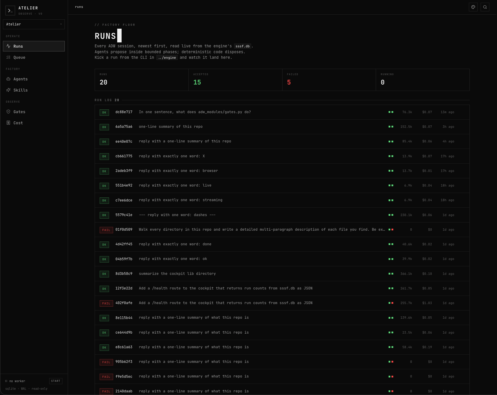
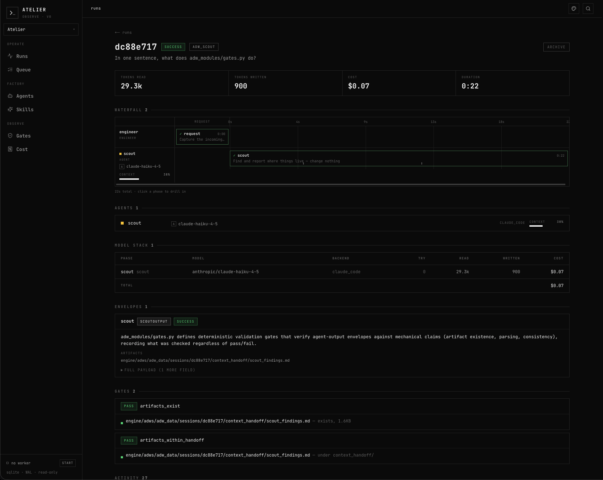
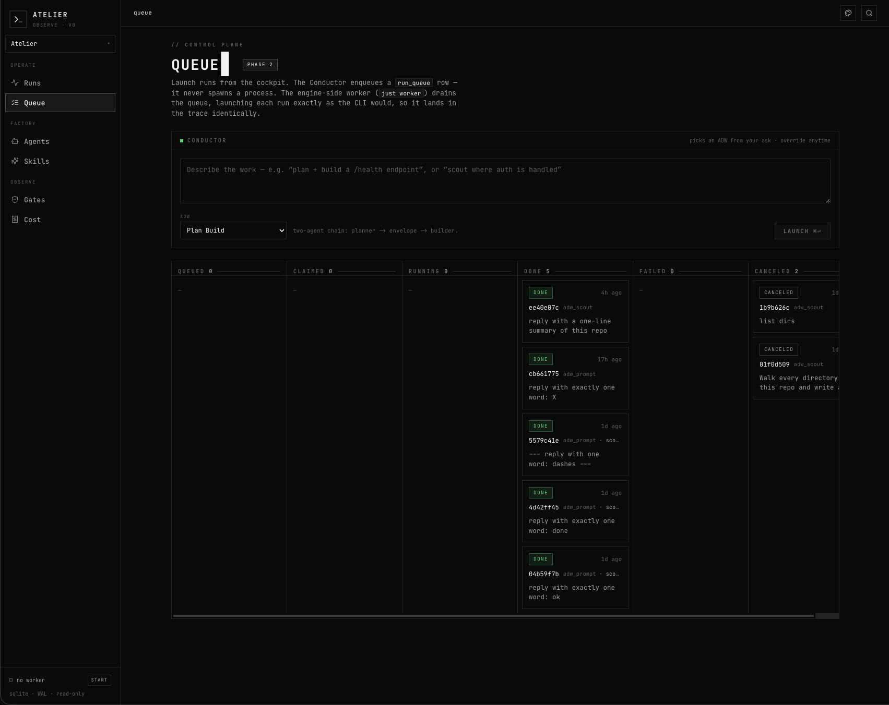
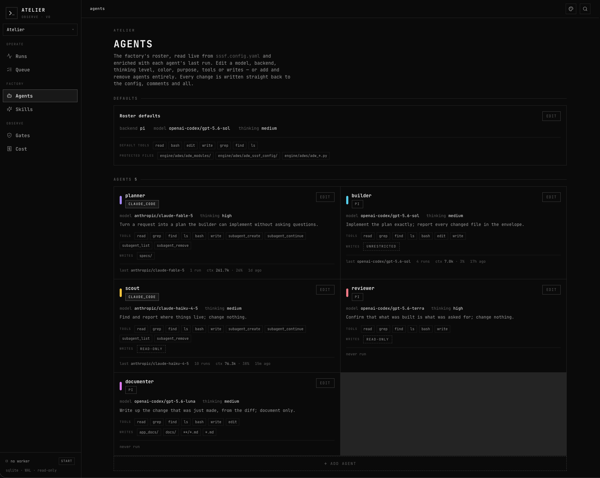
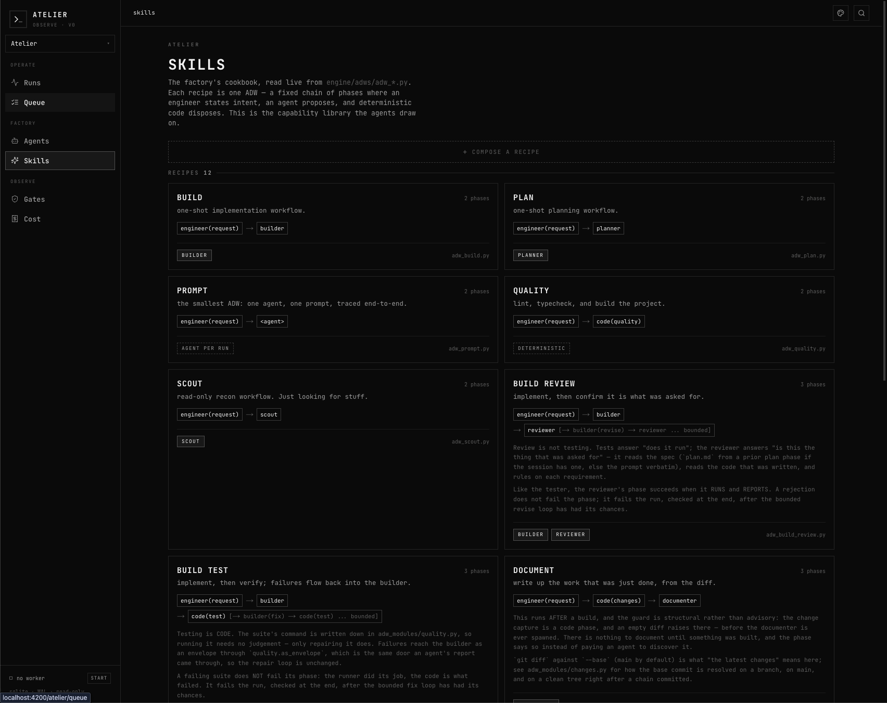
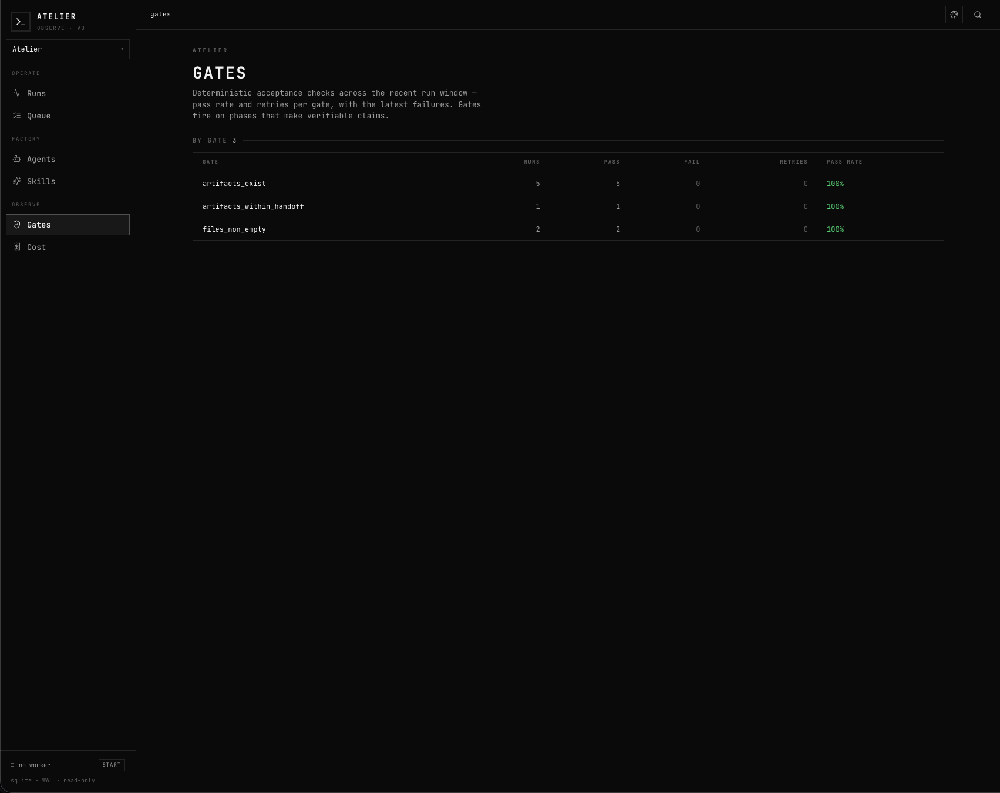
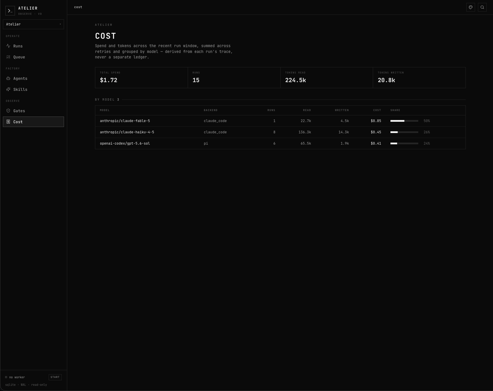

# Atelier

A workshop where **agents propose and deterministic code disposes**. It bolts the
[Super-Simple Software Factory](https://github.com/)'s ADW engine onto an operator
cockpit borrowed from [FounderOS](https://github.com/Bennettxai/FounderOS-DEMO)'s "Monolith Signal"
design system. Agents work inside bounded phases, Python decides sequencing and
acceptance, and every event streams to a UI you can watch.

The whole thing rests on one seam: **both halves treat SQLite as the single source
of truth.** The engine writes the live trace; the cockpit reads it back.

```
┌──────────┐   writes    ┌─────────────────────────────┐   reads (readonly, WAL)   ┌──────────┐
│  engine  │ ──────────▶ │  engine/adws/adw_data/sssf.db │ ◀──────────────────────── │ cockpit  │
│ (Python) │             │   7 tables · the contract     │                           │ (Next.js)│
└──────────┘             └─────────────────────────────┘                           └──────────┘
```

## Layout

| Path        | What it is                                                              |
| ----------- | ----------------------------------------------------------------------- |
| `engine/`   | SSSF stamped in via its `install.py`. Runs ADWs, writes `sssf.db`.      |
| `cockpit/`  | Fresh Next.js 14 app. Reads `sssf.db` through a Zod-validated repo layer. |
| `docs/`     | The build plan (`atelier-plan.html`) and usage guide.                   |

> **Note on git:** `engine/` shares this repo's single git root (no nested `.git`).
> SSSF anchors on the git root. `pi`'s `-e` paths, the write-boundary diff, and
> commit phases all resolve there, so every engine config path is `engine/`-prefixed
> and ADWs are run from the repo root. `repo_root()` is therefore the atelier root:
> the factory self-hosts (it can build Atelier itself), guarded by `protected_files`.

## The seam contract

`cockpit/lib/types.ts` is the frozen TypeScript mirror of the engine's schema
(`engine/adws/adw_modules/tracer.py`), and `cockpit/lib/schemas.ts` is the Zod
enforcement of it. Python↔TS drift is the architecture's #1 risk, so it's made
machine-checkable:

```bash
cd cockpit && pnpm check:contract   # asserts every expected column exists in the live db
```

## Running it

**Engine: kick a run (writes to the shared db). Run from the repo root:**

```bash
just demo                      # two cheap read-only runs, end to end
# or a single one:
uv run engine/adws/adw_prompt.py --config engine/adws/adw_sssf_config/sssf.config.yaml \
  --agent scout "reply with a one-line summary of this repo"
```

**Cockpit: watch runs land (reads the shared db):**

```bash
cd cockpit
pnpm install
pnpm dev                       # http://127.0.0.1:4200
```

The cockpit finds the db via `SSSF_DB` in `cockpit/.env.local` (an absolute path to
`engine/adws/adw_data/sssf.db`).

## Stamping into another repo

Atelier can **stamp its engine into any git repo**. After that, the repo runs its own
ADWs and keeps its own trace. The payload is generated *live* from `engine/adws/`
(no committed templates to drift) at the native `adws/` layout, no `engine/` prefix.

**First stamp.** Run from your Atelier checkout:

```bash
uv run engine/adws/install.py /path/to/target-repo   # add --init to create + git-init a target that isn't a repo yet
```

What lands, and why the buckets matter for updates:

| Bucket    | What                                                                       | On update |
| --------- | -------------------------------------------------------------------------- | --------- |
| MANAGED   | engine code Atelier owns: `adws/adw_modules/*.py`, `adws/adw_*.py`, and the `/atelier` operator skill (`.claude/skills/atelier/**`) | kept current (hashed in `.atelier/manifest.json`) |
| USER      | `adws/adw_sssf_config/sssf.config.yaml`, prompts, the justfile, `.env.sample`, your own ADWs/skills | stamped once, never touched again |
| RUNTIME   | `adws/adw_data/sessions/`, `sssf.db*`                                       | gitignored, never stamped |

Install is **idempotent by refusal**: if `.atelier/manifest.json` already exists it
stops and points you at `update.py`, so a re-run can never clobber your roster.

**Run an ADW from the stamped repo** (native layout, no `engine/` prefix):

```bash
cd /path/to/target-repo
uv run adws/adw_scout.py --config adws/adw_sssf_config/sssf.config.yaml "one-line summary of this repo"
just sessions                  # the justfile is stamped in; the trace lands in the repo's own sssf.db
```

Before running build/test ADWs, edit the stamped `sssf.config.yaml`'s `quality:` /
`verify:` block to match the target's own test/lint commands.

**The `/atelier` operator skill.** Every stamp also lands a Claude Code skill at
`.claude/skills/atelier/`: the operator manual for driving the factory *in that repo*
(run / create / update ADWs, tune the roster, observe runs), with cookbooks and references
written for the native `adws/` layout. Its single source is `engine/skills/atelier/`
(symlinked into this checkout as `.claude/skills/atelier`, so `/atelier` works here too; the
skill is layout-aware and translates `adws/` → `engine/adws/` when it detects the source repo).
It is **MANAGED**, so `update.py` keeps its docs in lockstep with engine behavior; a cookbook
you hand-edit is parked as `<file>.atelier-new`, never clobbered. Claude Code autoloads it;
other agent harnesses (codex, cursor, pi) don't scan `.claude/skills/`, so point their own
rules file at `.claude/skills/atelier/SKILL.md` rather than copying it (a copy drifts, and a
pointer in `AGENTS.md`/`CLAUDE.md` would leak into the ADW coding agents via guidance injection).

**Pull later engine improvements.** Reconciled per file by content hash; your edits are
never clobbered (a conflict is written beside the file as `<file>.atelier-new`):

```bash
uv run engine/adws/update.py /path/to/target-repo
```

**Front many stamped repos from one cockpit.** Register each in
`cockpit/atelier.projects.json` (gitignored; copy `atelier.projects.example.json`).
`root` may be absolute or relative to `cockpit/`; `adwsSubdir` is `adws` for a stamped
repo (`engine/adws` for Atelier self-hosting):

```json
[
  { "id": "my-app", "name": "My App", "root": "/abs/path/to/target-repo", "adwsSubdir": "adws" }
]
```

The cockpit then routes each project under `/<id>/…` with a switcher. A **supervisor**
keeps one worker draining each project's queue:

```bash
uv run engine/adws/adw_worker.py --supervise   # reads the registry; the ONLY thing that spawns workers
```

Start/stop a project's worker from the cockpit sidebar footer: it writes a
`workerDesired` flag the supervisor disposes; the cockpit itself never spawns a process.

## Two coding-agent backends

The engine picks a backend per agent via `coding_agent:` in the config (D1 in the plan):

| Backend       | `coding_agent` | Drives                        | Auth |
| ------------- | -------------- | ----------------------------- | ---- |
| **pi**        | `pi`           | GPT-5.6 (Sol/Terra/Luna), etc | pi's own (`~/.pi/agent`) |
| **Claude SDK**| `claude_code`  | Claude (Haiku/Sonnet/Opus)    | Claude Code's own login (`claude`) |

`agent_cc.py` implements the Claude backend against `claude-agent-sdk`; it mirrors
`agent_pi.run`'s contract exactly (streamed tool events, envelope text, cost/usage,
session resume) so `agents.execute()` treats both identically.

**Current roster:** scout → `anthropic/claude-haiku-4-5` (Claude SDK); builder →
`openai-codex/gpt-5.6-sol` (pi); planner → `anthropic/claude-fable-5`.

> ⚠️ **pi no longer supports Anthropic.** So `agents.py::load_config` **forces
> `coding_agent: claude_code` for any `anthropic/*` model**, regardless of the roster.
> Claude always goes through the SDK (the `claude` CLI's own login, no API key), and pi
> only ever runs non-Anthropic models. A stray `coding_agent: pi` on an `anthropic/*`
> agent is corrected at load, so no roster can mis-route it. Also: `pi` 0.81.1 has no
> `~/.pi/agent/models.json`, so `engine/.env` points `PI_MODELS_PATH` at a local stub
> (and `context_window()` degrades to unknown when even that is absent, e.g. a stamped repo).

## Build status

- **Phase 0: Foundations & the seam** ✅ Monorepo up; engine runs; schema frozen +
  contract-checked; design system lifted; cockpit renders real runs from the shared db.
- **Phase 1: Observe** (next). The three views on real data: Runs log · live Process
  Map · Run detail (phases + envelope + gates).
- Phases 2–5: control plane · observability/cost · authoring · real-time. See
  `docs/atelier-plan.html`.

## The cockpit

Every view reads live from the shared `sssf.db`, in FounderOS's "Monolith Signal" terminal aesthetic.

**Runs: the factory floor.** Every ADW session newest-first, with acceptance, tokens, cost, and phase-progress dots per row.



**Run detail.** Drill into one run: the phase waterfall, the agent + model stack, the typed envelope, and the deterministic gates that accepted it (here the read-only `scout` passing `artifacts_exist` and `artifacts_within_handoff`).



**Queue: the control plane.** Describe work to the Conductor, which enqueues a `run_queue` row; the engine-side worker drains it, launching each run exactly as the CLI would. The cockpit never spawns a process.



**Agents: the roster.** Each agent's model, backend, thinking level, tools, and write boundary, read live from `sssf.config.yaml` and editable straight back into it, comments and all.



**Skills: the recipe catalog.** One card per ADW, showing its phase chain, parsed live from the `adw_*.py` docstrings.



**Gates & Cost: the rollups.** Per-gate pass/fail/retry health, and spend + tokens grouped by model, both derived from each run's trace, never a separate ledger.




