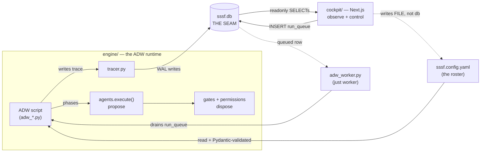

# Architecture

This is the mental model for the whole system. Read it before the subsystem guides — every
one of them assumes the vocabulary set here: the **seam**, the **propose/dispose** boundary,
the **determinism spine**, and the **three mirrors**. For the terse canonical version of these
rules, see [`AGENTS.md`](../AGENTS.md) at the repo root; this doc is the longer explanation.

## What Atelier is

Atelier is a **software factory**: agents propose, deterministic code disposes. It has two
halves that never call each other directly:

- The **engine** (`engine/`) — a Python "ADW" (AI Developer Workflow) runtime that runs coding
  agents inside bounded phases and decides sequencing and acceptance.
- The **cockpit** (`cockpit/`) — a Next.js 14 app that observes and controls the engine.

They meet at **one SQLite file, `engine/adws/adw_data/sssf.db`**. The engine writes the live
trace; the cockpit reads it. That file *is* the seam — treat it as the single source of truth.

## The two halves, in one paragraph each

**The engine.** An ADW is a self-contained [PEP 723](https://peps.python.org/pep-0723/) `uv`
script (e.g. `adw_scout.py`, `adw_plan_build.py`) that composes **phases**. A phase is one of
three kinds: `engineer` (human intent), `agent` (a model proposes via
`run.phase(...).call(AgentCall(...))`), or `code` (deterministic disposition — a gate, a git
commit, a test run). `adw_modules/` is the shared library behind all of them. See
[Engine runtime](02-engine-runtime.md) and [Authoring ADWs](04-authoring-adws.md).

**The cockpit.** A Next.js App Router app whose read path is **readonly by construction** —
`lib/db.ts` opens `sssf.db` with `readonly: true` and every query is a `SELECT`. Its write path
is deliberately tiny (see the determinism spine below). See [The cockpit](06-cockpit.md).

## Agents propose, deterministic code disposes

This is the core boundary and the whole point of the system. An `agent` phase does **not** get
to decide whether its own work is acceptable:

1. A model produces output, which is parsed against a typed **envelope** (a Pydantic
   `EnvelopeBase` subclass — `ScoutOutput`, `PlanOutput`, `BuildOutput`, …). Malformed JSON is
   corrected in the same session, bounded.
2. Deterministic **gates** (`gate(envelope, run) -> GateReport`) check the envelope's claims
   mechanically — do the declared artifacts exist, does the JSON parse, is the review verdict
   self-consistent. A gate failure re-prompts the same agent session with the violations,
   bounded by the phase's retry budget.
3. A deterministic **write-boundary check** (`permissions.enforce`) diffs the working tree
   before/after the call and rolls back anything the agent wasn't allowed to touch. A breach is
   **not** a gate — the write already happened, so it aborts the phase rather than re-prompting.

Deterministic results (a test run, a git diff) are shaped into the *same* envelope types
(`VerifyOutput`, `ChangesOutput`) so they flow back into a builder through exactly the door an
agent's report would. Full mechanics: [Agents, gates & the write boundary](03-agents-and-gates.md).

## The determinism spine (do not break)

The invariant that makes a cockpit-launched run **byte-for-byte identical** to a CLI-launched
one:

- **The cockpit must never spawn a run process** and must never mutate a run's trace or
  acceptance. To launch a run it only `INSERT`s a row into the `run_queue` table; to stop one it
  only sets `cancel_requested`.
- **`engine/adws/adw_worker.py` (`just worker`) is the only thing** that turns a queued row into
  a running ADW — and it builds the exact CLI argv a human would type. So a UI-launched run has
  the same trace and the same acceptance as a CLI one.
- Cancel = SIGTERM the process group; the ADW's own signal handler closes its trace honestly.

There is exactly **one deliberate exception**: `/api/adws` shells out to `make_adw.py` to
*generate* a new ADW `.py` source file (Phase 4 authoring). That's a pure deterministic code
generator — no model call, no db write, no run trace — so it doesn't turn a queued row into a
running process. Generating a recipe is not running one. See [Authoring ADWs](04-authoring-adws.md).

## The write surfaces

There are exactly three places anything gets written, and they are kept apart on purpose:

| Surface | Writer | Target | Guard |
| --- | --- | --- | --- |
| The **trace** | the ADW subprocess, via `tracer.py` | `sssf.db` (sessions/phases/events/…) | only the run writes its own trace |
| The **control plane** | the cockpit, via `lib/control.ts` | `sssf.db` — **only** the `run_queue` and `sandboxes` tables | a separate read-write connection; enqueue + cancel a run, create + land + shut down a sandbox — INSERTs and flag flips, never a spawn |
| The **roster config** | the cockpit, via `lib/roster.ts` | the **file** `sssf.config.yaml` (not the db) | surgical byte-range splice, atomic write; the engine re-validates via Pydantic at run time |

The read path (`lib/db.ts`) is a fourth, separate, **readonly** connection, kept apart from the
control connection so it can never accidentally acquire write intent.

## The three Python↔TS mirrors

Because the seam is a database defined in Python and read in TypeScript, three definitions must
stay in lockstep. Only the first is machine-checked.

| Mirror | Python source | TypeScript mirror | Checked by |
| --- | --- | --- | --- |
| Trace schema | `adw_modules/tracer.py` (`SCHEMA` + `MIGRATIONS`, plus `queue.py`'s `RUN_QUEUE_DDL` and `sandboxes.py`'s `SANDBOXES_DDL`) | `cockpit/lib/types.ts` + `cockpit/lib/schemas.ts` (`TABLE_COLUMNS`) | **`pnpm check:contract`** |
| Roster config | `adw_modules/data_types.py` (`SSSFConfig`/`AgentConfig`/`ConfigDefaults`) | `cockpit/lib/roster.ts` (Zod) | by hand (it's a file, not a db table) |
| ADW block catalog | `make_adw.py`'s block catalog | — (read live via `--list-steps --json`) | no static mirror — the generator is the source |

**Any change to a table in `tracer.py` MUST be mirrored in both TS files**, or Python↔TS drift
silently corrupts the reader. This is the #1 rule; the checklist lives in
[Extending the system](08-extending-the-system.md).

## Three coding-agent backends

`agents.execute()` treats all three identically behind one abstraction (config key
`coding_agent:`); each exposes the same `run(...) -> PiResult` contract:

- `pi` → `agent_pi.py`, drives models like GPT-5.6 via the `pi` CLI (auth in `~/.pi/agent`).
- `claude_code` → `agent_cc.py`, drives Claude via `claude-agent-sdk` using the local `claude`
  CLI's own login (**no API key**).
- `cursor` → `agent_cursor.py`, drives Cursor's models via the `cursor-agent` CLI
  (`cursor-agent login`, **no API key**), proxying Anthropic/OpenAI/Grok/Kimi/Composer. Model ids
  use the `cursor/` namespace. Two bounded degradations: no dollar cost (subscription billing) and
  no live context-window valve (usage arrives only on the terminal event → cooperative handoff
  only). See [Config & roster](05-config-and-roster.md).

**Machine gotcha on this box:** pi's Anthropic OAuth is expired, so pi can only run
`openai-codex/*` models — which is *why* Claude agents (`planner`, `scout`) route through the
SDK. A run sending an `anthropic/*` model through `coding_agent: pi` will fail. See
[Config & roster](05-config-and-roster.md).

## Git & path layout (the factory self-hosts)

`engine/` is **not** a nested repo — it shares this single git root. `repo_root()` resolves to
the atelier root via `git rev-parse --show-toplevel`, so **the factory can build itself**. The
consequences bite if you forget them:

- **Run engine ADWs from the repo root**, e.g. `uv run engine/adws/adw_prompt.py --config engine/adws/…`.
- Every engine config path is `engine/`-prefixed **except `writes:` allowlists**, which are
  **repo-root-relative** (they match where agents actually write: `specs/`, `docs/`, …).
- `defaults.protected_files` (`engine/adws/adw_modules/`, `adw_sssf_config/`, `adw_*.py`) keeps
  an agent from editing the machinery that grades its own work — the factory can't rewrite its
  own graders unless an agent's `writes:` explicitly names them. Enforcement:
  [Agents & the write boundary](03-agents-and-gates.md); operations view:
  [Operations](07-operations.md).

## Where to go next

- Operate it: [Operations](07-operations.md).
- Understand a run end-to-end: [Engine runtime](02-engine-runtime.md) →
  [Agents & gates](03-agents-and-gates.md).
- Change it: [Extending the system](08-extending-the-system.md).
- The locked roadmap and build state: [`docs/atelier-plan.html`](atelier-plan.html) and
  [README](README.md).
